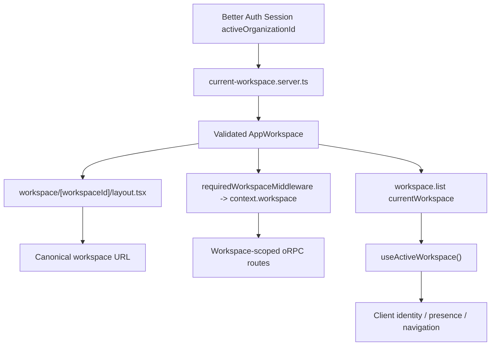

# Workspace Architecture

## Goal

The workspace system has one clear rule:

**The only source of truth for the current workspace is the validated server-side workspace resolved from the Better Auth session.**

Everything else is derived from that.

---

## Core Principles

1. **Session-derived workspace is authoritative**

   - The current workspace comes from `session.activeOrganizationId`
   - That value is validated against Prisma membership
   - If stale, the app falls back to a valid membership
   - If possible, the session is healed with `setActiveOrganization()`

2. **URL is a canonical representation, not a source of truth**

   - `/workspace/[workspaceId]` is the public route form
   - The URL must match the resolved current workspace
   - The URL does not decide which workspace is active

3. **Server routes trust workspace context**

   - Workspace-scoped oRPC routes use `context.workspace`
   - They do not trust route params for workspace identity

4. **Server pages/layouts trust the workspace helper**

   - Use `getCurrentWorkspace()` when optional
   - Use `requireCurrentWorkspace()` when mandatory
   - No-arg server-component calls are request-cached, so repeated calls in the same request reuse the same resolved workspace

5. **Client components trust query-derived current workspace**

   - Use `useActiveWorkspace()` for workspace identity
   - Do not use `params.workspaceId` for presence, realtime, or navigation identity

6. **Onboarding stays separate**
   - Onboarding uses `OnboardingState.workspaceId`
   - Onboarding workspace state is not the same as current app workspace state

---

## Source of Truth

### Authoritative current workspace

- `lib/workspace/current-workspace.server.ts`

This file owns:

- reading Better Auth session
- reading `activeOrganizationId`
- validating membership in Prisma
- fallback workspace selection
- best-effort session healing
- mapping DB organization to `AppWorkspace`
- request-scoped memoization for no-arg server-component reads

### Public server API

- `resolveWorkspaceForSession({ session, headers })`
- `getCurrentWorkspace({ headers? })`
- `requireCurrentWorkspace({ headers? })`

### Trust rule

- Server code should never manually resolve current workspace anywhere else

---

## Trust Hierarchy

### Highest trust

- `requireCurrentWorkspace()`
- `getCurrentWorkspace()`

### Route-level trust

- `context.workspace`

### Client-side trust

- `currentWorkspace` from `orpc.workspace.list()`
- `useActiveWorkspace()`

### Lowest trust

- `params.workspaceId`

`params.workspaceId` is only a route token, never the authority.

---

## File Responsibilities

## 1. Global Middleware

### File

- `middleware.ts`

### Responsibility

- Arcjet only
- generic edge concerns only

### Must not do

- read session for current workspace
- validate workspace membership
- redirect workspace URLs
- call Prisma for workspace authority

---

## 2. Server Workspace Contract

### File

- `lib/workspace/current-workspace.server.ts`

### Responsibility

- single server authority for current workspace

### Must do

- resolve current workspace from session
- validate against membership
- fallback safely
- optionally heal active org
- memoize no-arg reads per request for server components

### Must not do

- page redirects
- route param logic
- UI logic

### Caching rule

- `getCurrentWorkspace()` and `requireCurrentWorkspace()` without explicit `headers` may reuse a request-cached result
- explicit `headers` calls still resolve normally and are not forced through the server-component cache path

---

## 3. oRPC Workspace Middleware

### File

- `app/middlewares/workspace.ts`

### Responsibility

- thin adapter between request/session and `context.workspace`

### Must do

- get session
- call `resolveWorkspaceForSession()`
- throw if missing
- inject `context.workspace`

### Must not do

- duplicate fallback logic
- define workspace business policy

---

## 4. Workspace Management Router

### File

- `app/router/workspace.ts`

### Responsibility

- list workspaces
- create workspace
- select workspace
- update workspace

### Rules

- `workspace.list` may use `getCurrentWorkspace({ headers })`
- `workspace.select` validates membership before switching
- `workspace.create` creates and returns workspace identity
- `workspace.update` acts only on the validated active workspace context

### Must not do

- duplicate workspace resolution logic inline
- trust raw route params as workspace authority

---

## 5. Workspace-Scoped Routers

### Files

- `app/router/channel.ts`
- `app/router/message.ts`
- `app/router/member.ts`
- `app/router/ai.ts`

### Responsibility

- perform workspace-scoped business logic

### Rule

Always trust:

```ts
context.workspace.id
```

### Must not trust

- `params.workspaceId`
- raw `session.activeOrganizationId`

---

## 6. Workspace Route Boundary

### File

- `app/(dashboard)/workspace/[workspaceId]/layout.tsx`

### Responsibility

- canonicalize workspace route
- reconcile URL against authoritative workspace
- prefetch workspace-scoped shell data

### Rule

Use:

```ts
const workspace = await requireCurrentWorkspace()

if (workspace.id !== workspaceId) {
  redirect(`/workspace/${workspace.id}`)
}
```

### Why

This is the single place where URL and current workspace meet.
This is where route canonicalization belongs

---

## 7. Recovery Route

### File

- `app/(dashboard)/workspace/page.tsx`

### Responsibility

- optional workspace recovery

### Rule

Use:

```ts
const workspace = await getCurrentWorkspace()
```

If found:

- redirect to `/workspace/${workspace.id}`

If not:

- continue recovery flow

---

## 8. Workspace Server Pages

### Files

- `app/(dashboard)/workspace/[workspaceId]/page.tsx`
- any future server page under `/workspace/[workspaceId]`

### Responsibility

- page-level logic after route has already been canonicalized

### Rule

Do not trust `params.workspaceId` for workspace identity.

If workspace identity is needed:

```ts
const workspace = await requireCurrentWorkspace()
const workspaceId = workspace.id
```

### Acceptable use of params

- formatting URLs after reconciliation only

---

## 9. Workspace Client Identity

### File

- `hooks/use-active-workspace.ts`

### Responsibility

- canonical client-side workspace identity

### Rule

Client components that need workspace identity should use:

```ts
useActiveWorkspace()
```

### Should return

currentWorkspace
currentWorkspaceRole
canManageWorkspace
workspaceId
workspacePath
presenceRoom
user
workspaces

### Why

This removes `useParams().workspaceId` as a client-side identity source.

---

## 10. Client Components

### Must use `useActiveWorkspace()` for

- presence room ids
- realtime room ids
- workspace-scoped navigation destinations
- workspace identity checks
- workspace-scoped cache keys

### May still use route params for

- channelId
- active tab state
- active channel rendering state
- presentational route reading

### Examples

Use `useActiveWorkspace()` in:

- `CreateNewChannel.tsx`
- `WorkspaceMembersList.tsx`
- `MembersOverview.tsx`
- `ChannelList.tsx`
- `WorkspaceHeader.tsx`
- `WorkspaceList.tsx`

### Do not use `params.workspaceId` for

- `presenceRoom`
- `router.push("/workspace/...")` workspace identity
- `href="/workspace/..."` workspace identity
- workspace-scoped React Query key identity

---

### 11.Query Cache Contract

### Rule

Workspace-scoped client cache keys must encode workspace identity.

Examples

- workspaceQueryKeys.channelList(workspaceId)
- workspaceQueryKeys.memberList(workspaceId)

### Why

Server authority may be correct while client memory is stale if workspace identity is not part of the key.

### Hydration Rule

- server prefetch and client components must use the same query key shape.

---

## 12. UI Data Pages

### Files

- `app/(dashboard)/get-started/page.tsx`
- `app/(dashboard)/no-workspace/page.tsx`
- `app/(dashboard)/workspace/layout.tsx`

### Responsibility

- render workspace-related UI data
- hydrate shell-level workspace data

### Rule

Use:

- `orpc.workspace.list()`

These are UI/data pages, not authority boundaries.

---

## 13. Onboarding

### Files

- `app/router/onboarding.ts`
- onboarding pages,layouts and components

### Responsibility

- onboarding workflow state only

### Source of truth

- `OnboardingState.workspaceId`

### Important rule

Do not replace onboarding workspace state with current active workspace state.

These are different concepts.

---

## Request Flow



---

## Best-Practice Rules

### Server routes

Use:

```ts
context.workspace.id
```

### Server pages and layouts

Use:

```ts
requireCurrentWorkspace()
```

or:

```ts
getCurrentWorkspace()
```

### Server components

- Prefer resolving once in parent and passing `workspace` as a prop when it is simple.

- If multiple server components call the no-arg helper in the same request, request caching prevents repeated workspace resolution work.

### Client identity

Use:

```ts
useActiveWorkspace()
```

### URL params

Use only for:

- channel route state
- active link state
- presentational route reading

---

## Anti-Patterns To Avoid

Do not do these:

- read `params.workspaceId` and treat it as current workspace identity
- build presence rooms from `params.workspaceId`
- build workspace navigation destinations from `params.workspaceId`
- read `session.activeOrganizationId` outside the helper
- query Prisma directly in random pages to resolve current workspace
- duplicate workspace fallback logic outside `current-workspace.server.ts`
- use global `middleware.ts` for workspace resolution
- mix onboarding workspace state with current app workspace state
- use broad workspace-scoped query keys that omit workspace identity

---

## Final Summary

The workspace architecture is:

- **Better Auth session** provides intended active organization
- **`current-workspace.server.ts`** turns that into a validated `AppWorkspace`
- **request-cached no-arg server-component** reads reduce repeated resolution work without changing authority
- **workspace route layout** canonicalizes the URL once
- **oRPC middleware** injects the authoritative workspace into routes
- **workspace-scoped routes** trust `context.workspace`
- **server pages and layouts** trust the helper
- **client components** trust `useActiveWorkspace()`
- **workspace-scoped query keys** encode workspace identity
- **URL** is only the canonical route representation
- **onboarding** uses separate workflow state

This keeps workspace identity consistent across server routes, server pages, server components, and client UI without weakning the authority model.
